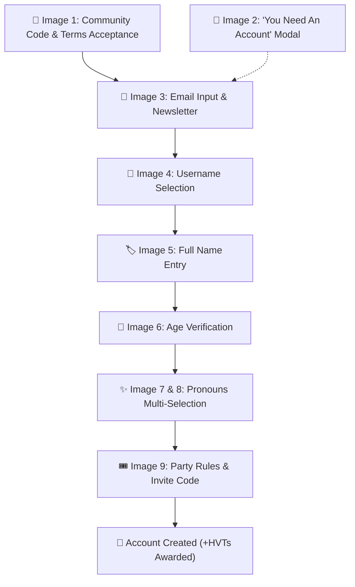

# Extroverts Mobile App — Signup & Onboarding Flow Specification

> Comprehensive step-by-step breakdown, UI design specifications, copy, validation rules, and data models based on the mobile app design screens located in `public/signup-flow/`.

---

## 🗺️ Flow Overview



---

## 🎨 Global UI & Design System Tokens

- **Theme Mode**: Deep Dark / Pure Black (`#000000` / `#0A0A0A`).
- **Brand Accent**: Electric Violet / Neon Purple (`#9B62FF` / `#A855F7`).
- **Typography**: Clean Modern Sans-serif with bold headline tracking, all-caps subheaders, and stylized purple word-highlights.
- **Top Brand Mark**:
  - Left: Signature **"E•"** App Logo.
  - Right: **"GETTING READY"** badge / step indicator label.
- **Form Controls**:
  - **Inputs**: Rounded dark cards with subtle gray borders, uppercase labels (`USERNAME`, `NAME`, `AGE`, `PRONOUNS`), and clear placeholder styling.
  - **Buttons**: Full-width pill / rounded-xl action buttons.
    - **Primary**: Solid White background (`#FFFFFF`), Bold Black text (`#000000`).
    - **Secondary**: Dark / Transparent background, White border (`#FFFFFF`), White text.
  - **Bottom Sheets / Drawers**: Dark modal sheets with top drag handle indicator and top-right close icon (`✕`).

---

## 📱 Detailed Step-by-Step Screen Specifications

---

### Step 0: Welcome & Community Guidelines (Terms Acceptance)

**Source**: `image1.jpg`


#### 1. Screen Elements

- **Header**: "E•" Brand Logo.
- **Manifesto Headline**:
  > **"BY USING THIS APP, YOU’RE AGREEING TO KEEP THINGS FUN, SAFE, AND RESPECTFUL... AND ALSO AGREEING TO OUR TERMS AND CONDITIONS. POLITENESS IS A MUST—TREAT OTHERS HOW YOU’D WANT TO BE TREATED. EVERYONE HERE IS LOOKING FOR REASONS TO <span style="color:#9B62FF">PARTY</span>, SO BRING YOUR BEST VIBE AND EXPECT THE SAME FROM OTHERS. LET'S PARTY RESPONSIBLY AND MAKE EVERY EXPERIENCE A GREAT ONE!"**
  > _(Keyword **PARTY** is emphasized in violet/purple)._
- **Footer Disclaimer**:
  - Text: `To proceed, accept Terms and Conditions` (with clickable link to legal terms).
- **CTA Button**:
  - `ACCEPT` (Primary White Solid Button).

#### 2. Functional Requirements & State

- User must tap **ACCEPT** to confirm consent to community standards and legal terms before proceeding to the registration flow.

---

### Step 0.5: In-App Account Trigger / Gate Modal (Interstitial)

**Source**: `image2.jpg`


#### 1. Trigger Context

Displayed when an unauthenticated guest user attempts to interact with authenticated features (such as joining a private party, viewing exclusive club tiers, or earning Honorary Vibe Tokens).

#### 2. Modal Elements

- **Sheet Header**: Centered Drag Handle + Top-right Close Button (`✕`).
- **Headline**: `YOU NEED AN ACCOUNT`
- **Body Copy**:
  > _"Create an account to join events, earn HVTs, and party with extroverts near you– all for free!"_
- **Action Buttons**:
  1. `GET STARTED` (Primary White Solid Button) — Launches the Onboarding Flow.
  2. `MAYBE LATER` (Secondary Dark Outline Button) — Dismisses the modal and keeps guest in browse mode.

---

### Step 1: Email Entry & Newsletter Subscription

**Source**: `image3.jpg`


#### 1. Screen Elements

- **Header**: "E•" Brand Logo.
- **Title**: `Enter your email` (Large Display Font).
- **Form Inputs**:
  - **Email Field**:
    - Placeholder: `EMAIL`
    - Input Type: `email`
    - Auto-capitalization: `none`
    - Auto-correct: `off`
  - **Newsletter Checkbox**:
    - Style: Circular custom checkbox.
    - Label: `I'd like to subscribe to your newsletter` (Default: `false` or optional `true`).
- **CTA Button**:
  - `PROCEED` (Primary White Solid Button).

#### 2. Validation & Flow Logic

- Validates standard RFC 5322 email syntax.
- On tapping `PROCEED`, sends OTP / verification magic link or proceeds to identity profile creation.

---

### Step 2: Choose Username

**Source**: `image4.jpg`


#### 1. Screen Elements

- **Header**: "E•" Logo on left, `GETTING READY` on right.
- **Title**: `Create a username that fits your vibe!`
- **Form Input**:
  - **Label**: `USERNAME`
  - **Input Box**: Dark rounded container with active cursor/text (e.g., `ashutoshtiwaridm1`).
  - **Helper Text**:
    > _"All your Superlatives and Invites will come your way with this name, so make it unforgettable!"_
- **Navigation Controls**:
  - `NEXT` (Primary White Button)
  - `BACK` (Secondary Outline Button)

#### 2. Validation Rules

- Unique handle check (Debounced API availability check).
- Allowed characters: alphanumeric lowercase and underscores (`^[a-z0-9_]{3,24}$`).
- Cannot contain profanity or reserved keywords.

---

### Step 3: Full Name (Party Check)

**Source**: `image5.jpg`


#### 1. Screen Elements

- **Header**: "E•" Logo on left, `GETTING READY` on right.
- **Title**: `"Name, please, for the party check!"`
- **Form Input**:
  - **Label**: `NAME`
  - **Input Box**: (e.g., `Ashutosh Tiwari`).
  - **Helper Text**:
    > _"This is the name shown as on members and requests. Cannot be changed later."_
- **Navigation Controls**:
  - `NEXT` (Primary White Button)
  - `BACK` (Secondary Outline Button)

#### 2. Validation Rules

- Required field (Min 2 chars, Max 50 chars).
- Warning highlighted to user that this display name is permanent for security/reputation on member badges and meetup requests.

---

### Step 4: Age Verification

**Source**: `image6.jpg`


#### 1. Screen Elements

- **Header**: "E•" Logo on left, `GETTING READY` on right.
- **Title**: `How many years have you been partying?`
- **Form Input**:
  - **Label**: `AGE`
  - **Input Box**: Numerical input or custom age selector.
  - **Helper Text**:
    > _"We need your age to verify you're eligible and help others know who they’re connecting with."_
- **Navigation Controls**:
  - `NEXT` (Primary White Button)
  - `BACK` (Secondary Outline Button)

#### 2. Validation Rules

- Minimum age requirement (e.g., must be 18+ to join social events and parties).
- Input must be a valid integer between 18 and 100 (or birthdate calculation).

---

### Step 5: Pronouns Selection

**Source**: `image7.png` & `image8.png`

|         5A: Input View (`image7.png`)          |        5B: Multi-Select Modal (`image8.png`)        |
| :--------------------------------------------: | :-------------------------------------------------: |
|  |  |

#### 1. Screen Elements — Input View (5A)

- **Header**: "E•" Logo on left, `GETTING READY` on right.
- **Title**: `Which pronouns feel right for you?`
- **Interactive Selector**:
  - **Label**: `PRONOUNS`
  - **Trigger Box**: Tap opens the multi-select bottom sheet.
  - **Helper Text**: `Select the pronouns that feel right for you.`
- **Navigation Controls**:
  - `NEXT` (Primary White Button)
  - `BACK` (Secondary Outline Button)

#### 2. Screen Elements — Bottom Sheet Selector (5B)

- **Modal Header**: `SELECT PRONOUNS` with Close Icon (`✕`).
- **Limit Subtitle**: `Select upto 3` (Maximum 3 selections allowed).
- **Selectable Options List** (with circular selection boxes):
  - `he`
  - `him`
  - `his`
  - `she`
  - `her`
  - `hers`
  - `they`
  - `them`
  - `theirs`
  - `ze`
  - `zir`
  - `zirs`
  - `ve`
  - `ver`
  - `vis`
- **Bottom Action**:
  - `PROCEED` (Primary White Button — saves selected array to state).
- **Footer Feedback Action**:
  - `Did we miss anything?` (Opens custom input dialog or feedback channel for unlisted pronouns).

---

### Step 6: Party Code & Invite Code (Token Reward)

**Source**: `image9.jpg`


#### 1. Screen Elements

- **Header**: "E•" Logo on left, `GETTING READY` on right.
- **Party Rules Manifesto** (Bold uppercase with vibrant violet keyword styling):
  - `KINDNESS = GOOD` **`HAIR`** `DAY`
  - `SIP IN?` **`CHIP`** `IN.`
  - `GHOSTING IS FOR` **`HALLOWEEN`**`.`
  - `OUTFITS LOUD,` **`INTENTIONS`** `CLEAR.`
  - `JOINING? FREE. HOSTING?` **`ALSO`** `FREE.`
  - `EARLLY IS` **`ICONIC`**`.`
  - `YES.` **`SPELLING`** `MISTAKE.`
- **Form Input**:
  - **Label**: `ENTER INVITE CODE (optional)`
  - **Input Box**: Clean text input with uppercase formatting.
  - **Reward Subtitle**: `Enter invite code and get up to +30 HVTs!`
- **Navigation Controls**:
  - Primary Action Button with **Loading Spinner / Submit State** (`⁑`).
  - `BACK` (Secondary Outline Button).

#### 2. Gamification & Token Logic

- If valid referral code is provided:
  - Invitee receives **+30 HVTs** (Honorary Vibe Tokens) upon completion.
  - Inviter receives referral reward tokens.
- On submit, creates user session, mints welcome tokens, and routes user to the main app feed.

---

## 💾 Data Model & Types Specification

```typescript
export interface SignUpFormData {
  // Step 0: Consent
  agreedToTerms: boolean;

  // Step 1: Account & Communication
  email: string;
  subscribedToNewsletter: boolean;

  // Step 2: Identity & Handle
  username: string;

  // Step 3: Legal / Display Name
  fullName: string;

  // Step 4: Demographics
  age: number;

  // Step 5: Pronouns (Max 3 items)
  pronouns: string[];

  // Step 6: Referral / Onboarding Bonus
  inviteCode?: string;
}

export type PronounOption =
  | 'he'
  | 'him'
  | 'his'
  | 'she'
  | 'her'
  | 'hers'
  | 'they'
  | 'them'
  | 'theirs'
  | 'ze'
  | 'zir'
  | 'zirs'
  | 've'
  | 'ver'
  | 'vis';

export interface SignUpStepState {
  currentStep: 0 | 1 | 2 | 3 | 4 | 5 | 6;
  isSubmitting: boolean;
  error: string | null;
  earnedTokens: number;
}
```

---

## 🔒 Form Validation Rules Summary

| Field                | Required | Constraints                           | Error Message                                             |
| :------------------- | :------: | :------------------------------------ | :-------------------------------------------------------- |
| **Terms Acceptance** |  ✅ Yes  | Must be `true` to proceed             | "You must accept the terms and conditions to continue."   |
| **Email**            |  ✅ Yes  | Valid email format RFC 5322           | "Please enter a valid email address."                     |
| **Newsletter**       |  ❌ No   | Boolean (`true` / `false`)            | —                                                         |
| **Username**         |  ✅ Yes  | 3-24 chars, `[a-z0-9_]`, unique check | "Username must be 3-24 characters and available."         |
| **Name**             |  ✅ Yes  | 2-50 characters                       | "Please enter your legal or preferred full name."         |
| **Age**              |  ✅ Yes  | Integer >= 18                         | "You must be at least 18 years old to join Extroverts."   |
| **Pronouns**         |  ✅ Yes  | Array, 1 to 3 items selected          | "Please select between 1 and 3 pronouns."                 |
| **Invite Code**      |  ❌ No   | 6-12 chars uppercase alphanumeric     | "Invalid invite code. Leave empty if you don't have one." |

---

## 🚀 Key User Experience Guidelines

1. **Progressive Disclosure**: Each screen focuses on one single question/decision to reduce cognitive friction.
2. **Playful & Irreverent Tone**: Microcopy emphasizes fun, social vibes, and nightlife etiquette (_"How many years have you been partying?"_, _"Earley is iconic. Yes. Spelling mistake."_).
3. **Instant Reward Gratification**: Emphasizes the **+30 HVTs** incentive on the final step before onboarding completion.
4. **Seamless Navigation**: `BACK` action is available on all wizard steps with form state preserved in local/session memory.
